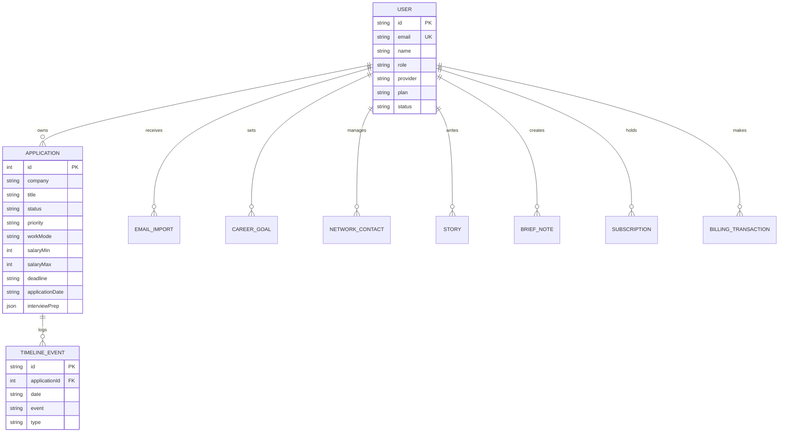

# ApplyTrack AI Studio — Full-Stack Job Search Operating System

<div align="center">


**Run the job search like a product studio, not a spreadsheet.**

A production-grade, full-stack career command center engineered with **TypeScript**, **Node.js**, **Express**, **GraphQL (Apollo Server)**, **Prisma ORM**, and **PostgreSQL**.

</div>

---

## 🎯 Overview

**ApplyTrack AI Studio** transforms job searching into an organized, signal-focused workflow. From the cinematic landing page to the high-density workspace, it integrates pipeline tracking, contact rolodex, daily briefings, STAR story repository, offer negotiation analytics, and AI career tools.

### 🌟 Key Highlights

- **100% Fidelity & Content Preservation**: Every view, modal, design token, font, animation, and seed record from the original studio prototype is preserved verbatim.
- **Full-Stack TypeScript**: End-to-end type safety across GraphQL queries, Prisma ORM schema, Express controllers, and frontend modules.
- **GraphQL API with Apollo Server**: Flexible querying and mutations with contextual user authentication and role-based permissions (`USER` & `ADMIN`).
- **Relational Data Modeling with PostgreSQL & Prisma**: Strongly-typed schema handling applications, timeline events, email imports, career goals, networking contacts, and billing transactions.
- **Offline & Local Resilience**: Seamlessly operates with local caching and auto-syncs with the GraphQL server when connected.
- **Dockerized Database**: Instant local setup with `docker compose up -d`.

---

## 🏗️ Architecture

```
ApplyTrack AI  Project/
├── .github/
│   └── workflows/
│       └── ci.yml               # Automated GitHub Actions CI pipeline
├── docker-compose.yml           # Local PostgreSQL 16 container setup
├── package.json                 # Monorepo orchestration scripts
├── .gitignore                   # Production git ignore configuration
├── .env.example                 # Root environment template
├── README.md                    # Project documentation
├── server/                      # Backend (Node.js, Express, GraphQL, Prisma)
│   ├── prisma/
│   │   ├── schema.prisma        # PostgreSQL Schema definition
│   │   └── seed.ts              # Seeder with default mock data
│   ├── src/
│   │   ├── index.ts             # Express & Apollo GraphQL Server entry
│   │   ├── context.ts           # GraphQL Context & JWT authentication
│   │   ├── db.ts                # Prisma client singleton
│   │   ├── schema/
│   │   │   ├── typeDefs.ts      # GraphQL Schema definition
│   │   │   └── resolvers/       # Modular query & mutation resolvers
│   │   ├── routes/
│   │   │   └── exportRoutes.ts  # REST endpoints for JSON/CSV backup exports
│   │   └── services/
│   │       └── aiSimulationService.ts # Career analysis algorithms
│   ├── tsconfig.json
│   └── package.json
└── client/                      # Frontend (Vite, TypeScript, Chart.js)
    ├── index.html               # Semantic HTML with exact studio layout
    ├── vite.config.ts           # Vite proxy & bundler config
    ├── tsconfig.json
    ├── package.json
    └── src/
        ├── types/               # TypeScript data interfaces
        ├── styles/              # Design tokens, themes & animations
        ├── api/                 # Typed GraphQL client
        ├── modules/             # Modular feature controllers
        │   ├── auth.ts          # Auth, roles, session & theme
        │   ├── dashboard.ts     # Command center & KPI analytics
        │   ├── applications.ts  # Application ledger & CRUD modals
        │   ├── kanban.ts        # Drag-and-drop pipeline board
        │   ├── calendar.ts      # Monthly interview & deadline grid
        │   ├── analytics.ts     # Chart.js visualization engines
        │   ├── brief.ts         # Today's daily brief & heat map
        │   ├── network.ts       # Relationship & recruiter management
        │   ├── offers.ts        # Offer desk & comp comparisons
        │   ├── stories.ts       # STAR interview behavioral bank
        │   ├── goals.ts         # Weekly target rings & streaks
        │   ├── aiTools.ts       # AI Match, salary & interview tools
        │   ├── emailImport.ts   # Recruitment inbox parser
        │   ├── settings.ts      # Gateway settings & backups
        │   ├── admin.ts         # Platform administration & approvals
        │   ├── commandBar.ts    # Global search (Ctrl+K) & navigation
        │   └── uxController.ts  # Polish, mobile nav & boot screen
        └── main.ts              # Frontend bootstrap
```

---

## 🗄️ Database Schema & Entities



---

## 🚀 Quick Start Guide

### Prerequisites
- **Node.js**: v18.0.0 or higher (v20+ recommended)
- **npm**: v9.0.0 or higher
- **Docker**: (optional, for PostgreSQL container)

### 1. Clone & Install Dependencies
```bash
git clone https://github.com/your-username/applytrack-ai.git
cd applytrack-ai
npm run install:all
```

### 2. Start PostgreSQL
You can run PostgreSQL via Docker Compose:
```bash
npm run db:up
```
*(Or point `DATABASE_URL` in `server/.env` to your existing PostgreSQL instance).*

### 3. Initialize & Seed Database
```bash
npm run prisma:generate
npm run prisma:push
npm run prisma:seed
```

### 4. Run Development Servers
Launch both backend (port `4000`) and frontend (port `5173`) concurrently:
```bash
npm run dev
```

Open your browser at:
- **Web App**: [http://localhost:5173](http://localhost:5173)
- **GraphQL Playground**: [http://localhost:4000/graphql](http://localhost:4000/graphql)
- **Health Check**: [http://localhost:4000/api/health](http://localhost:4000/api/health)

---

## 🔐 Credentials & Default Accounts

| Account | Email | Password | Role | Features |
| :--- | :--- | :--- | :--- | :--- |
| **Admin** | `admin@example.com` | `change-me-admin-password` | `ADMIN` | Admin Dashboard, user suspension, moderation & premium approvals |
| **Demo User** | `demo.user@example.com` | `change-me-demo-password` | `USER` | Pre-seeded with demo applications, contacts, and STAR stories |
| **Guest Mode** | *(Click "Guest" on Auth modal)* | *(None)* | `USER` | Instant workspace entry with local persistence |

---

## ⚡ Key Features

### 1. Unified Pipeline (Ledger & Kanban)
- Drag-and-drop cards across `Saved`, `Applied`, `Screening`, `Assessment`, `Interview`, `Final`, and `Offer`.
- Full-text search and multi-criteria filters by Status, Priority, and Work Mode.
- Stage change history recorded automatically in application timelines.

### 2. AI Career Tools
- **AI Job Match Score**: Evaluates resume keywords against JD requirements with strength and gap analysis.
- **Interview Success Calculator**: Dynamic probability modeling based on experience, prep level, and competitiveness.
- **Company Health Analyzer**: Evaluates hiring velocity, funding runway, and layoff signals.
- **Salary Negotiation Advisor**: Benchmarks 25th/50th/75th percentiles and generates tactical counter-offer talking points.
- **AI Follow-Up Email Generator**: Generates customized follow-up notes in multiple tones (Professional, Friendly, Concise, Confident).

### 3. Command Palette & Shortcuts
- `Ctrl + K` (or `Cmd + K`): Instant fuzzy search across companies, roles, and quick navigation.
- `?`: Open keyboard shortcuts reference modal.
- `N`: Quick-add new application.
- `G` then `D` / `A` / `K` / `G` / `C` / `S`: Instant jumping between Dashboard, Applications, Kanban, Goals, Calendar, and Settings.
- `Esc`: Dismiss any open dialog, modal, or panel.

### 4. Data Safety & Export
- **JSON Full Backup**: One-click complete database snapshot.
- **CSV Ledger Export**: Standard spreadsheet-ready tabular export.
- **Automatic Snapshots**: Auto-saved snapshots on every mutation with instant restoration.

---

## 📜 Available Scripts

```bash
# Development
npm run dev               # Start server and client concurrently
npm run build             # Compile TypeScript and bundle client
npm run start             # Run compiled production server

# Database (Prisma)
npm run db:up             # Launch PostgreSQL container
npm run db:down           # Stop PostgreSQL container
npm run prisma:generate   # Generate Prisma client types
npm run prisma:push       # Sync Prisma schema to database
npm run prisma:seed       # Seed database with default data
```

---

## 📄 License
This project is open-source under the [MIT License](LICENSE).
